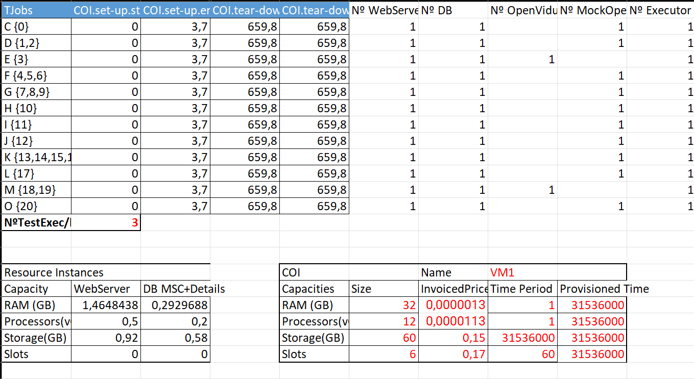
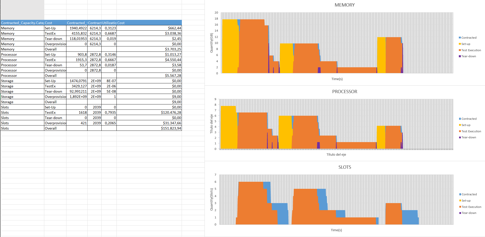

# Replication package for *'RETORCH\*: A Cost and Resource aware Model for E2E Testing in the Cloud'*

This repository contains the replication package of the paper *RETORCH\*: A Cost and Resource aware Model for E2E
Testing in the Cloud*
published at [TO-DO]

The replication package comprises various Execution Plan raw datasets generated by our Continuous Integration (CI)
system, along with the necessary scripts to generate the average datasets and the spreadsheets used to generate the
usage profiles for each Execution Plan. The following subsections introduce the package structure and the procedure.

## Replication package structure and naming conventions:

The naming conventions are :

- **Execution Plans**  are named using the level of parallelism (e.g., 5parallel, 4parallel, 3parallel).
- **JenkinsFiles** are named using the Execution Plan name followed by "-Jenkinsfile."
- **Execution Plan raw datasets**  are named with their Execution Plan, followed by "-raw-dataset-" and the execution
  number.

The replication package is structured as follows:

1. `/raw-datasets`: Execution Plan raw datasets generated by the Continuous Integration
   system. The data is organized into separate sub-folders one for each different Execution Plan (
   e.g., `./4parallel`, `./3parallel`, etc.).

2. `/scripts`: contains all the necessary Python scripting code for calculating the average datasets that are used as
   input for the cost model sheets.

3. `/tests`: contains different unit test cases that check the different methods contained in the `/scripts`
   directory processing and calculating the average datasets from the raw files.

4. `/generatedatasets.sh/ps1`:  scripts used to launch the data processing and calculation tasks within the project.

5. `/avg-datasets`: stores the output files generated by processing scripts. Each output file is named
   according to the Execution Plan that belongs in `/raw-datasets` (e.g., the file for
   `/raw-datasets/2parallel` will be saved as `./2parallel_avg.csv`).

6. `/profile-template.xlsx`: spreadsheet template that enables the Usage Profile calculations and illustrations.

7. `/jenkinsfiles`: holds different JenkinsFiles of the Execution Plans used in the different case studies
   related.

## Experimental Subject

The experimental subject is a real-world application
called [Fullteaching](https://github.com/codeurjc-students/2019-FullTeaching/tree/Angular-Refactor), used as a
demonstrator of the [ElasTest EU Project](https://elastest.eu/). FullTeaching provides an education platform composed
of several test resources, such as web servers, databases, and multimedia servers that allows to create online
classrooms, classes or publish and create class resources.

To the best of our knowledge, FullTeaching has two test suites available in different
repositories [[1]](https://github.com/elastest/full-teaching) [[2]](https://github.com/codeurjc-students/2019-FullTeaching/tree/Angular-Refactor).
The test suite used to generate the raw datasets provided in this replication package is a compilation of the available
test, cases in these repositories. The test suite, along with the necessary scripts and JenkinsFile required to run the
Execution Plan is made available as the version 1.1.0 in the [retorch-st-fullteaching](https://github.com/giis-uniovi/retorch-st-fullteaching)
GitHub repository.

## Treatment Replication Overview

The process consists of two distinct parts: the generation of average Execution Plan datasets performed through several
scripts, and the generation of the usage profile using a parameterized stylesheet with the previously calculated
datasets. These two parts are detailed below.

- **Average Execution Plan Datasets generation:** This process is accomplished through several scripts that take the raw
  datasets of each Execution Plan as input, organized in separate folders (one for each different execution plan). The
  raw datasets contain the start and end times of each Cloud Object Instance and TJob lifecycle. The scripts calculate
  the average duration of each lifecycle phase and generate a new file (identified by the Execution Plan name plus '_
  avg') with
  the start and end times of each phase based on these calculated averages.

- **Usage Profile generation:** The process takes one of the previously calculated average datasets as input. The
  dataset
  is manually incorporated into the stylesheet by the tester, who also parameterizes it according to the Cloud Object
  Instance they want to analyze (one alternative per stylesheet sheet). The stylesheet produces as output the Usage
  Profiles, as well as the different costs for each alternative.

## Treatment Replication Procedure

There are two options for conducting the replication process:

1. **Using Paper Datasets:** provided in the `/raw-datasets` folder.

2. **Execute BYS the different Execution Plans and generate your own datasets** using the made
   available [test suite](https://github.com/giis-uniovi/retorch-st-fullteaching) and
   the [execution plans](/jenkinsfiles) provided.

By following either of these options, you can successfully replicate the treatment and conduct your evaluation.

### Generate the average datasets and the Usage Profiles

To replicate the generation of the average datasets and the resource profiles of a concrete parametrization please
follow
the instructions outlined below:

1. From the scripts folder, execute the `/generatedatasets.sh/.ps1` script
2. Create a new Usage Profile stylesheet using the [template provided](profile-template.xlsx) and rename it with an
   appropriate name (e.g. OriginalexecutionplanProfile.xlns) and fine-tune the different parameters(outlined in red) :
    - Replace the average lifecycle time (A1:L13) with the selected Execution Plan average file (e.g.
      `/avg-datasets/3parallel_avg.csv`)
    - COI Capacities and Invoiced Prices:
        - Contracted_Capacity.Size: Units of capacity provisioned.
        - Invoiced_Price.price: Amount in dollars billed for each unit of capacity provisioned.
        - Billing_Option.Billing_Period: The time for which billing is calculated.
        - Provisioned time: Calculated as COI.Prov.Time - COI.Deprov.Time.
    - Test Suite Execution:
        - Number of test suite executions per hour.

   

3. Make as many copies of the Spreadsheet sheet as Cloud Object Instances, and adjust the parameters accordingly, in
   order get its different costs and usage profiles and compare and analyze them.

### Replication procedure outputs

The outputs of the replication procedure are the following:

- The average datasets stored into `/avg-datasets`
- The Usage Profiles as well as the different utilization and costs (overall, set-up, test execution, tear-down and
  overprovisioning) are shown in the bottom of the different sheets :
  

### Generate your own raw Execution Plan datasets

To generate your own raw Execution Plan datasets, you need to create a multibranch pipeline in your Jenkins
installation. The replication package provides several Execution Plans that can be used with
the [FullTeaching Test Suite](https://github.com/giis-uniovi/retorch-st-fullteaching). To use these Execution Plans, you
simply need to replace the JenkinsFile with the desired one and execute it.

The different raw datasets are archived as artifacts and can be downloaded directly. These datasets should be placed in
the `/raw-datasets` folder within a suitable sub-folder with the Execution Plan name (e.g.,
`/raw-datasets/customscheduling`).

Next, follow the steps provided in
the [Generate the average files and the Usage Profiles](#generate-the-average-datasets-and-the-usage-profiles) section.

## Contributing

See the general contribution policies and guidelines for *giis-uniovi* at
[CONTRIBUTING.md](https://github.com/giis-uniovi/.github/blob/main/profile/CONTRIBUTING.md).

## Contact

Contact any of the researchers who authored the paper; their affiliation and contact information are provided in the
paper itself.

## Citing this work

[TO-DO]
RETORCH E2E Test Orchestration framework:

- Cristian Augusto, Jesús Morán, Antonia Bertolino, Claudio de la Riva, and Javier Tuya,
  “RETORCH: an approach for resource-aware orchestration of end-to-end test cases”,
  *Software Quality Journal*, vol. 28, no. 3, 2020.
  https://doi.org/10.1007/s11219-020-09505-2 - [Full Paper available](https://link.springer.com/article/10.1007/s11219-020-09505-2) - [Authors version](https://digibuo.uniovi.es/dspace/bitstream/handle/10651/55405/RETORCHSQJExtension_BUO.pdf;jsessionid=0E661594C8732B8D2CA53636A31E4FD5?sequence=1) -
  [Download citation](https://citation-needed.springer.com/v2/references/10.1007/s11219-020-09505-2?format=refman&flavour=citation)

## Acknowledgments

This work has been developed under the TestBUS (PID2019-105455GB-C32) and EQUAVEL (PID2022-137646OB-C32) projects, both supported
by the [Ministry of Science and Innovation (SPAIN)](https://www.ciencia.gob.es/)
